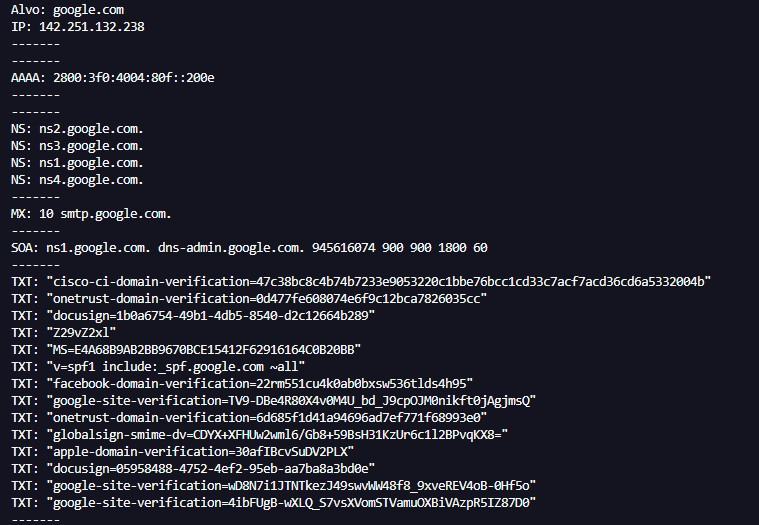

# DNS Enumeration Tool

🇧🇷 **Português:** [README.pt-BR.md](README.pt-BR.md)

A tool developed in **Python** to perform DNS record enumeration using the **dnspython** library.

The application queries multiple DNS record types and displays the information found in a simple and organized way.

---

## Features

- A (IPv4) record lookup
- AAAA (IPv6) record lookup
- CNAME record lookup
- PTR (Reverse DNS) record lookup
- NS record lookup
- MX record lookup
- SOA record lookup
- TXT record lookup
- Exception handling to prevent execution interruptions

---

## Technologies

- Python 3
- dnspython

---

## Installation

Clone this repository:

```bash
git clone https://github.com/your-username/dns-enumeration.git
```

Navigate to the project folder:

```bash
cd dns-enumeration
```

Install the required dependency:

```bash
pip install dnspython
```

---

## Usage

Run the program:

```bash
python enum_dns.py
```

Enter the target domain:

```
Target: google.com
```

---

## DNS Records

| Record | Description |
|--------|-------------|
| A | Returns the domain's IPv4 address. |
| AAAA | Returns the domain's IPv6 address. |
| CNAME | Returns the canonical name (alias) of a domain. |
| PTR | Performs reverse DNS resolution (IP → Domain). |
| NS | Lists the authoritative DNS servers for the domain. |
| MX | Lists the mail servers responsible for receiving emails. |
| SOA | Displays administrative information about the DNS zone. |
| TXT | Displays text records such as SPF, DKIM, DMARC, and domain verification records. |

---

## Notes

Not every domain has every type of DNS record. As a result, some records may not be displayed during execution.

For example, when querying `google.com`, the **CNAME** record is not returned because the root domain does not have a CNAME record. In this case, the `dnspython` library raises a `NoAnswer` exception, which is handled by the program so that execution continues normally.

The same may happen with other record types, such as **PTR**, depending on the DNS configuration of the domain or the queried IP address.

---

## Exception Handling

The program automatically handles common exceptions that may occur during DNS queries, including:

- NXDOMAIN
- NoAnswer
- Other exceptions raised by the library

This ensures that the application continues running even when a DNS record is unavailable.

---

## Example



---

## Documentation

https://dnspython.readthedocs.io/

---

## Author

**Linda Christi Freitas**

Software Engineering Student

Areas of interest:

- Cybersecurity
- Network Infrastructure
- Python
- Automation